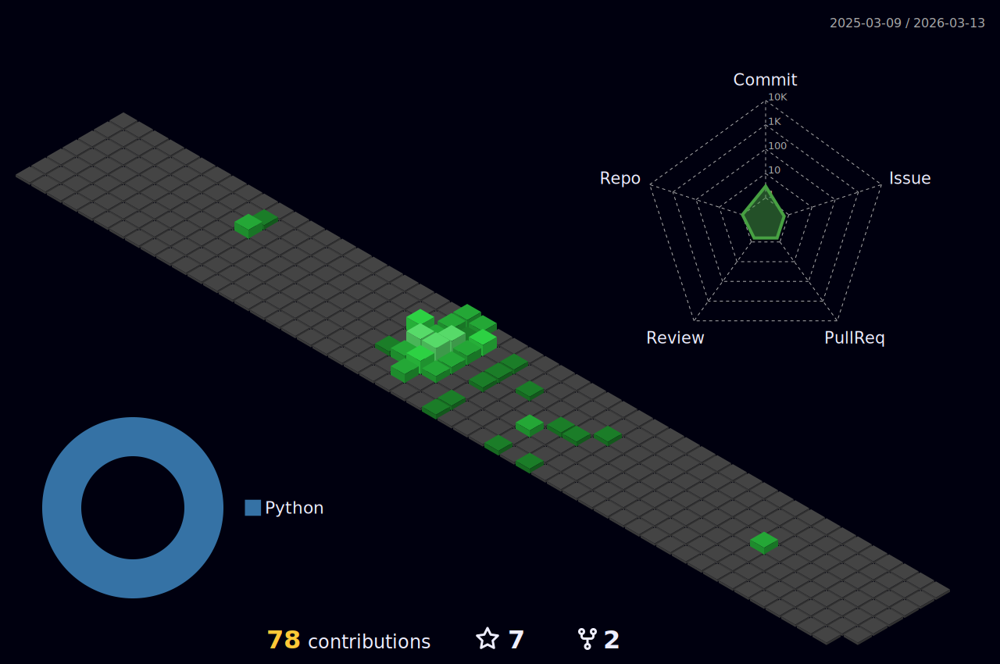

<h1 align="center">Hi, I'm Michael Son Nguyen</h1>
<h2 align="center">I want to become an expert Data Engineer</h3>
 

## 🙋‍♂️ About Me

  
- 💻 **I'm AI & Data Engineer **
- 👀 **As a Data Engineer, my focus is on crafting efficient data solutions** 
- **I specialize in designing scalable data pipelines, working with big data technologies, and optimizing databases**
- **Always eager to learn, I stay updated on the latest trends in data engineering**
- ✌ **This is my website** [In this Link](https://minhson1411.github.io/portfolio)

 
 
<h2 align="center">🔥 GitHub Stats 🔥</h2>
<!-- https://github.com/anuraghazra/github-readme-stats -->
 

  
  

 

    

 

<h2 align="center">👽 Where to find me 👽</h2>
 
<!-- https://icons8.com -->

  
  
  
  
  
  

 

